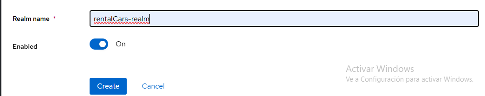

# Taller de microservicios
* Gian Marco Astori Payares
* Daniel José Cogollos Cerón
* Juan Luis Díaz Guerrero

## Configuración del servidor de Keycloak
### Paso 1
Ejecutar el docker-compose para montar los contenedores de Keycloak
### Paso 2
Acceder desde el navegador a la dirección http://localhost:8181
### Paso 3
Acceder al apartado de "Administration Console"
### Paso 4
Iniciar sesión con las siguientes credenciales:

**Usuario:** admin

**Contraseña:** admin
### Paso 5
Crear un nuevo realm (Es una especie de contenedor lógico para agrupar usuarios, aplicaciones y configuraciones relacionadas con la seguridad)

Colocarle como nombre rentalCars-realm y darle a create

### Paso 6
Ir al apartado de "Realm Roles" y presionar el botón "Create role"

Crear un rol con nombre "ADMIN" y otro rol con nombre "USER"

### Paso 7
Ir al apartado de "Users" y añadir dos usuarios(opcional, mínimo 1 usuario para probar) con el botón "Add user"

En la ventana de añadir usuario solamente rellenar los siguientes formatos:

Si el email es verificado pasar el slide a "Si".

Luego de esto presionar el botón de "Create" y la ventana cambiará, teniendo arriba una serie de opciones.

En estas nuevas opciones presionar "Credentials"

Presionar el botón "Set password" y se le coloca una contraseña cualquiera.
IMPORTANTE: cambiar el slide de "Temporary" a off.

Por último asignar los roles en el apartado de "Role mapping" asignando los roles de "ADMIN" y "USER" si es administrador o solo "USER" si es usuario.

### Paso 8
Ir al apartado de "Clients" y crear un cliente con el botón "Create client"

* En client_id colocar "rentarCars_client" y en el "Client type" colocar OpenID Connect. Darle "next"
* Colocar "Client authentication" y "Authorization" en On y en el "Authentication flow" dejar seleccionados "Standard fine", "Direct access grants", "OAuth 2.0" presionar "next"
* En "Valid redirect URIs" y en "Web Origins" colocar lo siguiente:

Por último guardar con el botón de "Save".

### Paso 9
En el application.properties del api-gateway cambiar un parámetro:

Lo que se pone ahí se saca desde la vista del cliente, presionar en "Credentials", copiar el "Client secret" y pegarlo ahí.

Ya me cansé

http://localhost:8080/*
http://localhost:8080/login/oauth2/code/keycloak
https://oauth.pstmn.io/v1/browser-callback
